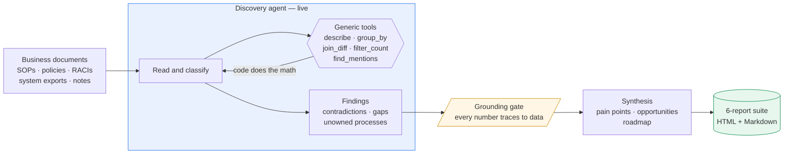

# Agentic Discovery Platform

> An AuroPro consulting accelerator. Point an LLM agent at an enterprise's messy business
> documents; it **discovers** the contradictions, undocumented processes, and control gaps — then
> produces a client-ready report suite. Runs on **any domain** with zero config.

<sub>Internal / proprietary · `prototype/` = the engine · `research/` = market & UI analysis</sub>

---

## How it works



**The agent reasons; code does the math.** It calls deterministic tools to compute over the data,
so every figure is exact and traceable — not an LLM guess.

---

## The output: a 6-report suite

| # | Report | Role |
|---|--------|------|
| 01 | Current State Assessment | Factual baseline + process-flow diagram (no judgements) |
| 02 | Pain Points & Opportunities | Issues ranked by impact, each → an opportunity |
| 03 | Transformation Recommendation | Value vs. feasibility 2×2 + sequencing |
| 04 | **AI Opportunity Portfolio** | **Centrepiece** — before/after per opportunity |
| 05 | Transformation Roadmap | Three horizons |
| 06 | Supporting Artefacts | System/data-flow map + source-document index (audit trail) |

---

## Design decisions (the why, in one line each)

- **Code does the math, the agent reasons** → numbers are exact & consistent across runs, never hallucinated.
- **Grounding gate** → a finding's every number must trace to a tool result, or it's rejected.
- **No platform jargon in client output** → a leak guard fails the build if tool names/filenames slip in.
- **Confidence by provenance, not self-report** → findings cite the documents they rest on.
- **Live by default, any domain** → report content is generated per run; an O2C fixture exists only as a demo-safe fallback.
- **Client-agnostic** → no org name unless detected from the docs; a run can suppress it.
- **Human-in-the-loop SME review** → the trust step and the basis of the "less stakeholder time" story.

Full rationale: [`prototype/docs/`](prototype/docs/) · competitive positioning: [`research/`](research/).

---

## Quickstart

```bash
cd prototype
uv sync                                   # env + deps
cp .env.example .env                      # add ANTHROPIC_API_KEY (or Azure vars)
uv run python scripts/doctor.py           # check connectivity
uv run python run.py --domain o2c --auto-resolve     # → opens out/o2c/index.html
```

Run on any domain by dropping its documents in `prototype/inputs/<domain>/`.

## Develop

```bash
uv run pytest                                   # tests
uv run pyrefly check discovery run.py scripts   # type-check product code
pre-commit install                              # enable hooks
```

`main` is protected — changes go through a PR with passing CI. See [CONTRIBUTING.md](CONTRIBUTING.md).

## Layout

```
prototype/      discovery engine + 6-report suite, tests, scripts, design docs
research/        market/competitor dossiers + UI/UX research (+ screenshots)
shared_context/  received engagement material (local only, gitignored)
```
